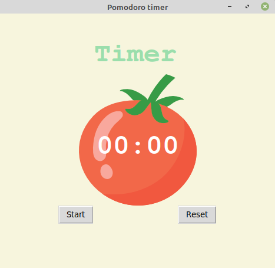
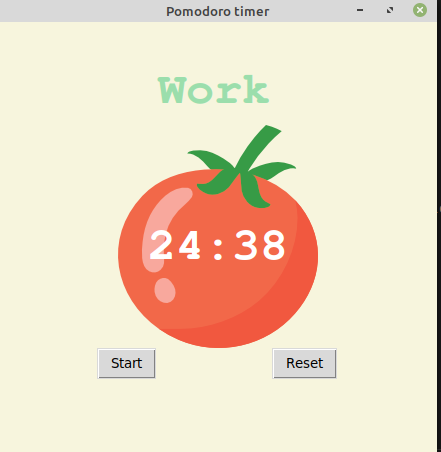

# Day28_pomodoro_timer


## Lessons learned today

- How to add images in tkinter

## Project to solidify material learned: 

### Preview:




### Miles to kilometers convertor

> Built with tkinter .. This is an application that is built off of the idea of the pomodoro technique that one can use when studying.

## How to run this on your device

- Clone this repository
```
git clone https://github.com/kingdreamerr/Day28_pomodoro_timer.git
```
- cd into the repo
```
cd Day28_pomodoro_timer
```

- Paste the following in the terminal 
```
python3 main.py
```